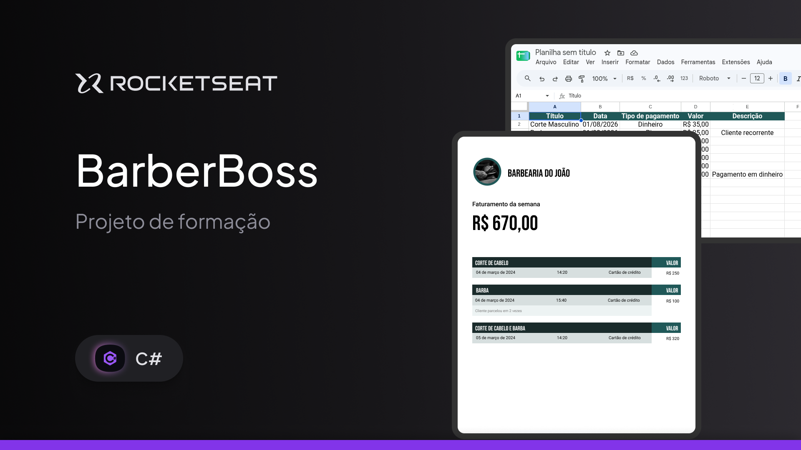

<h1 align="center">
  BarberBoss
</h1>

<p align="center">
  

  

  
  
  
</p>

<p align="center">
 <a href="#-sobre">Sobre</a> |
 <a href="#-endpoints">Endpoints</a> |
 <a href="#-setup">Setup</a> |
 <a href="#-tecnologias">Tecnologias</a> |
 <a href="#-arquitetura">Arquitetura</a> |
 <a href="#-licença">Licença</a>
</p>

<p>
  
</p>

---

## 💻 Sobre

O **BarberBoss** é uma API RESTful para gerenciamento de barbearia, desenvolvida em C# com ASP.NET Core. O sistema permite gerenciar faturas/billings e gerar relatórios, facilitando o controle financeiro e administrativo de um negócio de barbershop.

Este projeto foi desenvolvido como parte dos estudos em .NET e C#, aplicando conceitos de arquitetura em camadas e boas práticas de desenvolvimento backend.

Principais conceitos aplicados:
- Criação de API RESTful com `C#` e `ASP.NET Core 10`;
- Programação Orientada a Objetos;
- Arquitetura em camadas (Clean Architecture);
- Operações CRUD seguindo padrões RESTful;
- Entity Framework Core para persistência;
- Validação de dados com FluentValidation;
- Tratamento de exceções centralizado;
- Suporte a múltiplos idiomas (i18n);
- Documentação automática com Swagger/OpenAPI;
- Testes unitários com xUnit;

---

## 🌐 Endpoints

A documentação interativa dos endpoints pode ser acessada pelo Swagger: `http://localhost:5173/swagger` (ou na porta disponível na sua máquina)

A API está disponível na URL base `http://localhost:5173/api`, com os seguintes endpoints principais:

### Billings (Faturas)
| Método | Endpoint                              | Descrição                                  |
| ------ | ------------------------------------- | ------------------------------------------ |
| GET    | `/billings`                          | Lista todas as faturas                     |
| GET    | `/billings/{id}`                     | Obtém detalhes de uma fatura específica    |
| POST   | `/billings`                          | Cria uma nova fatura                       |
| PUT    | `/billings/{id}`                     | Atualiza uma fatura existente              |
| DELETE | `/billings/{id}`                     | Remove uma fatura                          |

### Reports (Relatórios)
| Método | Endpoint                              | Descrição                                  |
| ------ | ------------------------------------- | ------------------------------------------ |
| GET    | `/reports/excel`                      | Gera relatório de faturas em Excel         |
| GET    | `/reports/pdf`                        | Gera relatório de faturas em PDF           |

### Health Check
| Método | Endpoint                              | Descrição                                  |
| ------ | ------------------------------------- | ------------------------------------------ |
| GET    | `/health`                            | Verifica status da API                     |

---

## ⚙ Setup

### 📝 Requisitos

Antes de começar, certifique-se de ter instalado:

* [Git](https://git-scm.com)
* [.NET SDK 10+](https://dotnet.microsoft.com/download/dotnet)
* [Docker e Docker Compose](https://www.docker.com/) (para executar MySQL)
* [Visual Studio Code](https://code.visualstudio.com/) ou [Visual Studio](https://visualstudio.microsoft.com/) (opcional)

### Clonando o repositório

```bash
# Clone este repositório
git clone https://github.com/pabloxt14/barberboss.git

# Acesse a pasta do projeto
cd barberboss
```

### Configurando o banco de dados

O projeto utiliza **MySQL 8.4** via Docker Compose. Para iniciar o banco de dados:

```bash
# Inicie os serviços definidos no docker-compose.yml
docker-compose up -d

# Verifique se o container está rodando
docker-compose ps
```

O banco de dados será criado automaticamente com as credenciais definidas no `docker-compose.yml`:
- **Host**: localhost:3306
- **Database**: barberboss_db
- **User**: barberboss_user
- **Password**: @Password123

### Configuração de variáveis de ambiente

A connection string padrão já está configurada. Se necessário, ajuste no arquivo `src/BarberBoss.Api/appsettings.json`:

```json
{
  "ConnectionStrings": {
    "DefaultConnection": "Server=localhost;Port=3306;Database=barberboss_db;User=barberboss_user;Password=@Password123;"
  }
}
```

### Executando a aplicação

```bash
# Restaure as dependências (NuGet)
dotnet restore

# Execute as migrations do Entity Framework (opcional, banco já inicializa na primeira execução)
dotnet ef database update --project src/BarberBoss.Infrastructure

# Rode a aplicação
dotnet run --project src/BarberBoss.Api
```

A API ficará disponível em [http://localhost:5173/api](http://localhost:5173/api) (ou na porta que estiver disponível na sua máquina).

---

## 🛠 Tecnologias

Principais tecnologias e bibliotecas utilizadas:

* **Linguagem**: [C#](https://docs.microsoft.com/dotnet/csharp/)
* **Framework**: [.NET 10](https://dotnet.microsoft.com/pt-br/)
* **Web API**: [ASP.NET Core](https://docs.microsoft.com/aspnet/core/)
* **ORM**: [Entity Framework Core 9](https://docs.microsoft.com/ef/core/)
* **Database**: [MySQL 8.4](https://www.mysql.com/) (containerizado com Docker)
* **Validação**: [FluentValidation](https://docs.fluentvalidation.net/en/latest/)
* **Documentação**: [Swagger / Swashbuckle](https://github.com/domaindrivendev/Swashbuckle.AspNetCore)
* **OpenAPI**: [Microsoft.AspNetCore.OpenApi](https://learn.microsoft.com/en-us/aspnet/core/fundamentals/minimal-apis/openapi)
* **Containerização**: [Docker](https://www.docker.com/) & [Docker Compose](https://docs.docker.com/compose/)

> Veja mais detalhes das dependências nos arquivos `.csproj` de cada projeto

---

## 🏗 Arquitetura

O projeto segue o padrão de **Clean Architecture** com divisão em camadas:

```
BarberBoss/
├── src/
│   ├── BarberBoss.Api/                 # Camada de Apresentação (Controllers, Middlewares, Filters)
│   ├── BarberBoss.Application/         # Camada de Aplicação (Use Cases, DTOs, AutoMapper)
│   ├── BarberBoss.Communication/       # Camada de Comunicação (Requests, Responses, Enums)
│   ├── BarberBoss.Domain/              # Camada de Domínio (Entidades, Interfaces, Enums)
│   ├── BarberBoss.Exception/           # Tratamento de Exceções (Custom Exceptions, Mensagens)
│   └── BarberBoss.Infrastructure/      # Camada de Infraestrutura (EF Core, Migrations, Repositories)
└── tests/
    ├── CommonTestUtilities/            # Utilidades compartilhadas para testes
    └── Validators.Tests/               # Testes de validadores

```

### Conceitos implementados:

- **Separation of Concerns**: Cada camada tem responsabilidade bem definida
- **Dependency Injection**: Extensões para injeção de dependências
- **Exception Handling**: Filtro centralizado para tratamento de exceções
- **Middleware**: Middleware customizado para tratamento de cultura (i18n)
- **AutoMapper**: Mapeamento automático entre entidades e DTOs
- **Validação**: FluentValidation para validação de requests
- **Entity Framework Core**: Migrations e Data Access Pattern

---

## 📝 Licença

Este projeto está sob a licença MIT. Consulte o arquivo [LICENSE](./LICENSE) para mais informações.

<p align="center">
  Feito com 💜 por Pablo Alan 👋🏽 <a href="https://www.linkedin.com/in/pabloalan/" target="_blank">Entre em contato!</a>
</p>
